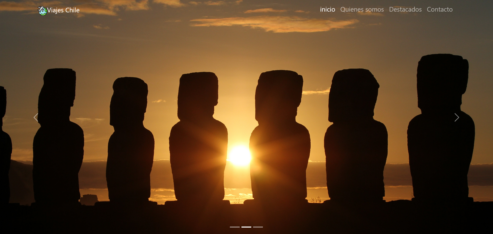
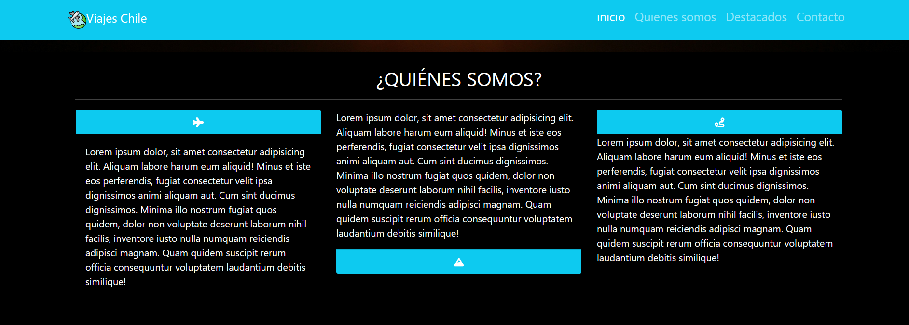
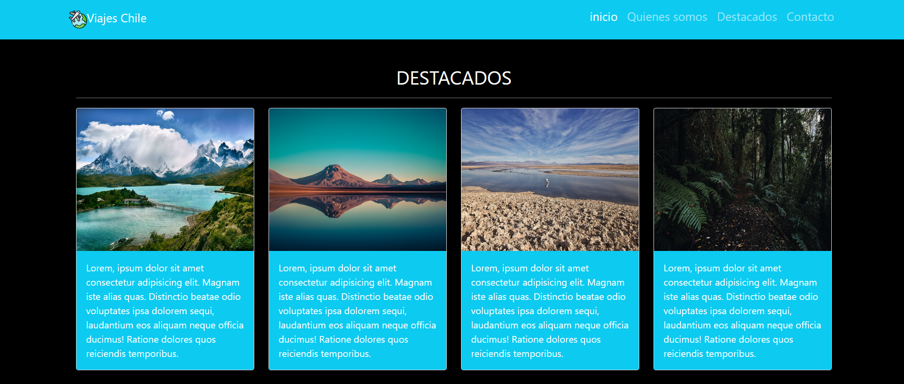
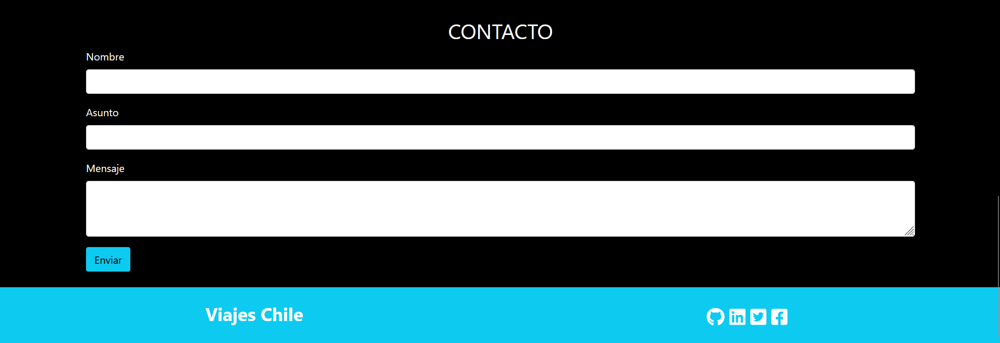
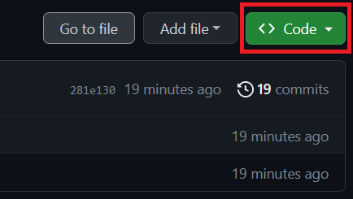
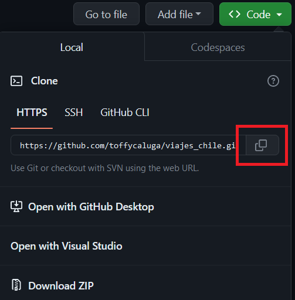
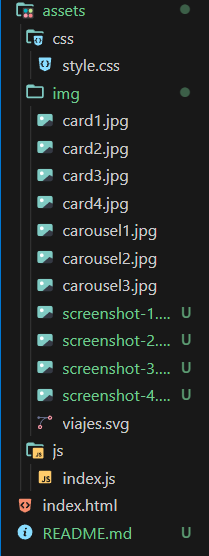

# Título del Proyecto

Viajes Chile, 
los mejores destinos para viajar por chile
## Descripción 
Proyecto realizado para medir conocimientos en htl ,css, Javascript,
como asi tambien con algunos framworks css como bootstraps y font awesom 
, efectuado por inforcap para bootcamp Ruby on Rails.

algunas imagenes del proyecto





## Comenzando 🚀

### Pre-requisitos 📋

tener instalado algún editor de código 

```
visual studio code
sublime Text
etc..

```

### Instalación 🔧
- en este repositorio, en su pagina principal . sobre la lista de archivos haz click en Code.




- luego copia la url de el repositorio



utiliza el comando git clone para clonar este repositorio , desde tu terminal, ubicado en el directorio donde guardaras el proyecto:

```
$ git clone https://github.com/toffycaluga/Meet-Coffee.git
```
presiona enter , aparecera un ensaje como este:

```
$ git clone[ https://github.com/YOUR-USERNAME/YOUR-REPOSITORY](https://github.com/toffycaluga/Meet-Coffee.git)
> Cloning into `Meet-Coffee`...
> remote: Counting objects: 10, done.
> remote: Compressing objects: 100% (8/8), done.
> remove: Total 10 (delta 1), reused 10 (delta 1)
> Unpacking objects: 100% (10/10), done.
```
luego de clonar , utiliza el comando cd  para entrar a la carpeta:

```
cd viajes_chile
```
para ver desde visual studio code puedes aplicar el siguiente comando

```
code .
```

esto abrira visual studio code desde este directorio

deberia verse asi 



## Construido con 🛠️

* **HTML**
* **CSS**
* [Bootstrap](https://getbootstrap.com/docs/5.3/getting-started/introduction/)
* [FontAwesoe](https://fontawesome.com/)

## Versionado 📌
se uso github parar el versionado
## Autores ✒️

* **Abraham Lillo** - *Trabajo Inicial* - [toffycaluga](https://github.com/toffycaluga)


También puedes mirar la lista de todos los [contribuyentes](https://github.com/your/project/contributors) quíenes han participado en este proyecto. 

<!-- 
## Licencia 📄

Este proyecto está bajo la Licencia (Tu Licencia) - mira el archivo [LICENSE.md](LICENSE.md) para detalles -->

## Expresiones de Gratitud 🎁
Este archivo README se desarrolla utilizando como referencia los siguientes proyectos:

* [README-español.md](https://gist.github.com/Villanuevand/6386899f70346d4580c723232524d35a) - created by [Andrés Villanueva](https://gist.github.com/Villanuevand)
* [Make a README](https://www.makeareadme.com) - created by [Danny Guo](https://github.com/dguo)
* [README](https://github.com/brayandiazc/template-readme/blob/main/README.md?plain=1)- inspirado por [Brayan Diaz](https://github.com/brayandiazc)
* Comenta a otros sobre este proyecto 📢
* Invita una cerveza 🍺 o un café ☕ a alguien del equipo. 
* Da las gracias públicamente 🤓.
* etc.


---
⌨️ con ❤️ por [Toffy Caluga](https://github.com/toffycaluga) 😊